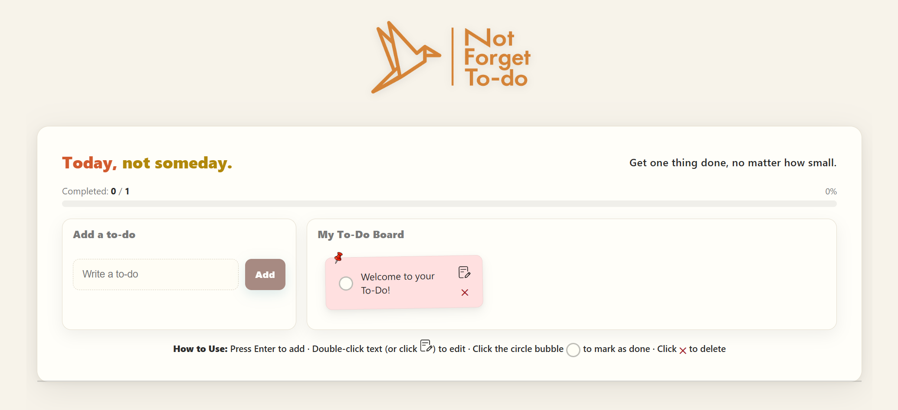

# 📝 To-Do Application

A simple, interactive To-Do application built with **React** for the frontend and **Node.js + Express** for the backend.  
This project demonstrates CRUD operations, REST API integration, and component-based UI design.

## 🚀 Features

### Frontend (React)
- **Add** new to-do items
- **View** all to-do items with empty state message
- **Mark as completed** with visual indication
- **Delete** to-do items instantly
- **Edit** existing to-do items (inline edit)
- Progress bar showing completion percentage
- Styled with sticky-note themed UI

### Backend (Node.js + Express)
- RESTful API with endpoints:
  - `GET /api/todos` → Retrieve all todos
  - `POST /api/todos` → Add a new todo
  - `PUT /api/todos/:id` → Update a todo (text/completed)
  - `DELETE /api/todos/:id` → Delete a todo
- In-memory data storage (no database)
- CORS and JSON body parsing middleware

## 📂 Project Structure

```
to-do-app/
│
├── backend/
│   ├── controllers/
│   │   └── todosController.js
│   ├── routes/
│   │   └── todos.js
│   ├── server.js
│   ├── package.json
│
├── frontend/
│   ├── public/
│   ├── src/
│   │   ├── components/
│   │   │   ├── AddTodo.js
│   │   │   ├── TodoItem.js
│   │   │   └── TodoList.js
│   │   ├── images/
│   │   ├── style/
│   │   │   └── styles.css
│   │   ├── api.js
│   │   ├── App.js
│   │   ├── index.js
│   │   └── ...
│   ├── package.json
│
├── README.md
└── ...
```

## ⚙️ Installation & Setup

### 1. Clone the repository
```bash
git clone <your-repo-url>
cd to-do-app
```

### 2. Backend setup
```bash
cd backend
npm install
npm run dev   # Start backend on http://localhost:3001
```

### 3. Frontend setup
Open a new terminal:
```bash
cd frontend
npm install
npm start     # Start frontend on http://localhost:3000
```

### 4. (Optional) Fix CRA build error about `web-vitals`

If you see the following error during deployment or build:
```
Module not found: Error: Can't resolve 'web-vitals' in 'src'
```

Run this command in the **frontend** directory to install the missing dependency:
```bash
npm install web-vitals
```

## 🌐 Environment Variables

Frontend `.env`:
```
REACT_APP_API_BASE=http://localhost:3001/api
``` 

## 🖱️ How to Use the Frontend

**Add a to-do**
- Type your task in the input box at the top.
- Press **Enter** to add it to the list.

**Mark as completed**
- Click the circle bubble next to the to-do to toggle completion status.

**Edit a to-do**
- **Double-click** the to-do text, or click the  icon.
- Type the new text and press **Enter** to save, click outside the input box to save, or press **Esc** to cancel.

**Delete a to-do**
- Click the **✕ Delete** button to remove the task immediately.

**Progress tracking**
- A progress bar at the top shows the percentage of completed tasks in real time.

> You can also test the backend API directly by visiting:  
> [https://wit-to-do-app.onrender.com/api/todos](https://wit-to-do-app.onrender.com/api/todos)

## 📸 Screenshots



## 📡 Deployment

- **Frontend**: [https://wit-to-do-app.vercel.app/](https://wit-to-do-app.vercel.app/)
- **Backend**: [https://wit-to-do-app.onrender.com](https://wit-to-do-app.onrender.com)
  - Test endpoint: [https://wit-to-do-app.onrender.com/api/todos](https://wit-to-do-app.onrender.com/api/todos)

> Make sure to update `REACT_APP_API_BASE` in `.env` for production.

## 🛠️ Technologies Used

**Frontend**
- React (Hooks: useState, useEffect, useCallback)
- Axios
- CSS3

**Backend**
- Node.js
- Express
- CORS

## 📜 License
This project is for educational purposes as part of a React & Node.js assignment.
